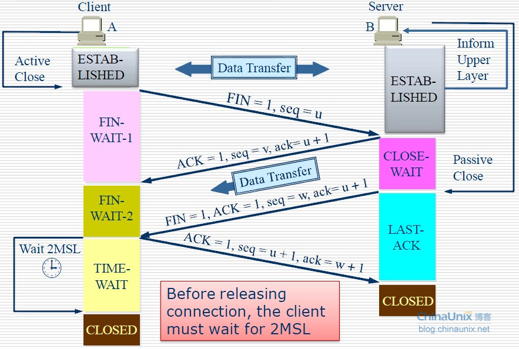

# 要点

-   tcp是双向的，所以主动断开方，只是关闭了单向发送，仍可以接收数据，所以需要4次通信才能完成完全关闭

# 为什么需要主动关闭方需要等待2MSL，有个`TIME_WAIT`状态？

1.  确保A(主动关闭方)发送的最后一个ACK报文(针对B发过来的断开连接请求的响应)可以被B收到

1.  确保整个通信链路中的**已失效的连接请求报文**已经被处理，保证后续新的TCP连接逻辑正常
