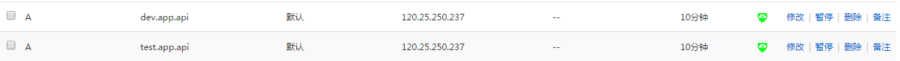

# 约定

-   基础域名 `base.com`

# 域名配置相关

# 官网(配置www)

[www].基础域名

# 后台接口

[用途].[项目简称].api.[基础域名]

用途:

    -   开发 `dev` `dev.app.api.base.com`
    -   测试 `test` `test.app.api.base.com`
    -   生产 为空 `app.api.base.com`

实例:

