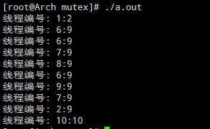

# 要求

1.  子线程升序打印线程编号(主线程传进去的)

1.  子线程升序打印全局变量

# 未同步前

## 代码

```C++
#define THREAD_NUM 10   // 线程个数
int count = 0;  // 共享资源


void *counter(void *arg)
{
    int num = *(int *)(arg);

    sleep(1);   // 处理其他无需同步的操作
    count++;
    cout << "线程编号: " << num << ":" << count << endl;

    return (void*)0;
}


int main(int argc, char *argv[])
{
    pthread_t tid[THREAD_NUM];

    for (int i = 0; i < THREAD_NUM; ++i) {
        if (pthread_create(&tid[i], NULL, counter, (void *)&i) != 0) {
            perror("pthread_create error");
            exit(1);
        }
    }
    sleep(5);

    return 0;
}
```

## 结果



## 原因及解决

-   创建子线程后,线程调度顺序不可预测(可能主线程先运行,也可能子线程先运行)

    解决: 同步主线程和子线程的运行顺序,使子线程运行后,主线程在运行

-   子线程对共享资源操作未同步

    解决: 对共享资源采取同步手段(互斥锁)

# 同步后

## 代码


