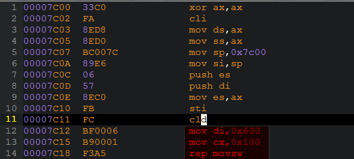

1.  开机或重启(CPU执行第一条指令，跳转到FFFF:0000H)

    Bochs模拟：

    

    Intel跳转指令：

    

1.  BIOS加电自检 (Power On Self Test)

1.  BIOS自检完毕后，执行int 19(自举服务)，按照CMOS中存储的设备启动顺序，将介质中的MBR扇区载入到0000:7C00处，

    检查其哨兵（0000:7DFE字）是否为(0x55AA)

    -   若是，则跳转到MBR载入位置(0000:7C00);

    -   若不是则载入下一个启动介质的MBR，重复操作，

    -   若没有找到合法MBR，则报错`Invalid partition table`、`operating system not found`、`Missing operating system`等类似错误，停机

1.  MBR首先将自己复制到0000:0600 处，然后继续执行

    

1.  在主分区表中搜索标志为活动的分区 . 如果发现没有活动分区或有不止一个活动分区 , 则转停止

1.  将活动分区的第一个扇区(叫做分区启动记录，Volume Boot Record, VBR)读入内存地址0000:7C00处

1.  检查(WORD)0000:7DFE是否等于0xAA55, 若不等于则显示`Missing Operating System`，然后停止

1.  跳转到0000 :7C00处继续执行bootloader stage 2，加载相应操作系统的启动程序

# 参考

1.  <https://www.ibm.com/developerworks/cn/linux/l-linuxboot/>
1.  [维基-主引导记录](http://zh.wikipedia.org/wiki/%E4%B8%BB%E5%BC%95%E5%AF%BC%E8%AE%B0%E5%BD%95)
1.  [wiki-Master_boot_record](http://en.wikipedia.org/wiki/Master_boot_record)
1.  <http://en.wikipedia.org/wiki/Boot_sector>
